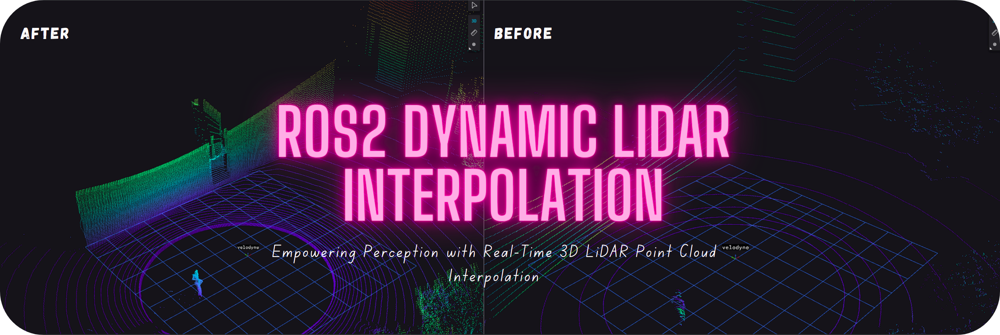

# Dynamic LiDAR Point Cloud Interpolation



ROS2 Real-time **3D LiDAR point cloud interpolation** package in C++, featuring:  
- **Runtime Configuration**: Adjust on the fly.  
- **Optimized Performance**: Fast and efficient.  
- **Full Control**: Precision interpolation.  

Watch demo: [video](https://youtu.be/3y5KldDH-Cc)


# 🛠️ **Key Capabilities**

1. **Dynamic Interpolation**  
   Generates dense, continuous LiDAR point clouds with customizable settings.

2. **Noise Reduction & Resampling**  
   Reduces noise and standardizes point spacing for high-quality outputs.

3. **Flexible Methods**  
   Offers multiple interpolation options:  
   - Bilinear  
   - Bilateral  
   - Edge-Aware  
   - Spline  
   - Nearest Neighbor

4. **High Performance**  
   Built in C++ for real-time processing with ROS2 compatibility.

5. **Cross-Platform**  
   Core interpolation is ROS2 independent pure C++, PCL and Eigen implementation ensures compatibility across different OS and platforms.

6. **Customizable**  
   Supports real-time parameter adjustments for adaptable applications.

7. **Easy Integration**  
   Seamlessly integrates into robotics and sensor fusion workflows.

---

# 🌐 **Key Applications**

1. **Autonomous Vehicles**  
   Enhances SLAM, mapping, and collision avoidance with smoother LiDAR data.

2. **Robotics**  
   Improves environmental perception for better decision-making.

3. **Digital Twins & Simulations**  
   Produces high-density point clouds for realistic virtual environments.

4. **Temporal Synchronization**  
   Aligns LiDAR with other sensors for accurate sensor fusion.

5. **Motion Distortion Correction**  
   Corrects rolling shutter effects for better mapping and object detection.

6. **Sparse Cloud Enhancement**  
   Densifies data for improved detection and segmentation performance.

7. **Splatting Map Generation**  
   Smooths point clouds using Gaussian splatting for advanced simulations.


---

## 🔍 Why Interpolation Matters ?

LiDAR sensors often produce sparse or inconsistent point clouds due to environmental conditions, affecting perception in autonomous systems. 
This package provides advanced interpolation techniques, ensuring complete and reliable point clouds for enhanced perception.

---

## 📦 Installation

### Prerequisites

Ensure your system has ROS2 installed, along with the necessary dependencies:

```bash
sudo apt update
sudo apt install ros-humble-pcl-ros
sudo apt install libeigen3-dev
```

### Clone and Build

1. Clone the repository:
    ```bash
    git clone https://github.com/geekgineer/dynamic_lidar_interpolation.git
    cd dynamic_lidar_interpolation
    ```

2. Build the workspace using `colcon`:
    ```bash
    colcon build
    ```

3. Source the workspace:
    ```bash
    source install/setup.bash
    ```
---

## 🚀 Running the Package

> [!NOTE]  
>  Refer to the [interpolation_config](config/interpolation_config.yaml) file to customize the behavior 

Make sure to download the sample bag from [here](https://drive.google.com/drive/folders/1uA7x1i5TlUeSm473ewYDzIrcny5JK8v7?usp=sharing)
to test the interpolation node with a recorded ROS2 bag file:

```bash
ros2 bag play data/velodyne_vlp16_outdoor --rate 1.0 --loop --clock
```

Then, launch the interpolation node using log level debug, info, warn, error, or fatal as needed:

```bash
colcon build --packages-select dynamic_lidar_interpolation --cmake-clean-cache

ros2 launch dynamic_lidar_interpolation pointcloud_interpolation_launch.py log_level:=info

```

> [!TIP]
> For production environments, you might want to limit debug logs to reduce verbosity.


---

## 🧩 Ranked Interpolation Methods (From Fastest to Slowest)

| Rank | Method            | Description                                                                     | Computational Efficiency |
|------|-------------------|---------------------------------------------------------------------------------|--------------------------|
| 1    | **Nearest Neighbor** | Assigns the value of the nearest point to each interpolated point, effective for filling sparse regions. | ⭐⭐⭐⭐⭐ (Very High Efficiency) |
| 2    | **Bilinear**      | Considers four nearest neighbors for interpolation, commonly used for quick upscaling. | ⭐⭐⭐⭐ (High Efficiency)   |
| 3    | **Bilateral**     | Balances spatial proximity and intensity similarity, preserving edges and reducing noise. | ⭐⭐ (Moderate Efficiency) |
| 4    | **Edge-Aware**    | Maintains object boundaries by preserving edges, ideal for object detection tasks. | ⭐⭐ (Moderate Efficiency) |
| 5    | **Spline**        | Uses piecewise polynomials for smoother transitions, providing gradual interpolations. | ⭐ (Low Efficiency)       |


---

## ✅ Tested For

1. **LiDAR Types**  
   - **Velodyne**: VLP-16
   - **Ouster**: OS0, OS1, OS2 series,OSDome..
   - **Robosense**: RS-BPearl.  

2. **Platforms**  
   - Tested extensively with **ROS2 Humble** middleware for seamless integration.  
   - Compatible across **Linux-based systems**, including Ubuntu 20.04 and 22.04.  

3. **Visualization Tools**  
   - Outputs verified with tools such as **RViz**, **Foxglove Studio** for point cloud analysis.  
   - Works well with third-party simulation tools like **Isaac Sim**, **Gazebo** and **CARLA**.  

---

## 📜 License

This project is licensed under the Affero General Public License (AGPL) version 3.0.

---

## Acknowledgment of Related Work

This project builds upon and is inspired by several foundational works in LiDAR data interpolation and augmentation. The following references have been instrumental in guiding the methodologies and approaches adopted:

1. Velasco-Sánchez, E., de Loyola Páez-Ubieta, I., Candelas, F. A., & Puente, S. T. (2023).  
   *LiDAR data augmentation by interpolation on spherical range image.*  
   Proceedings of the 2023 IEEE 28th International Conference on Emerging Technologies and Factory Automation (ETFA), pp. 1–4. IEEE.  
   [Link to Paper](https://ieeexplore.ieee.org/document/10275512)
   ```bibtex
   @inproceedings{velasco2023lidar,
     title={LiDAR data augmentation by interpolation on spherical range image},
     author={Velasco-S{\'a}nchez, Edison and de Loyola P{\'a}ez-Ubieta, Ignacio and Candelas, Francisco A and Puente, Santiago T},
     booktitle={2023 IEEE 28th International Conference on Emerging Technologies and Factory Automation (ETFA)},
     pages={1--4},
     year={2023},
     organization={IEEE}
   }
   ```

3. Xia, O., Zhao, L., & Zhou, Q. (2022).  
   *PolarMix: A General Data Augmentation Technique for LiDAR Point Clouds.*  
   arXiv preprint arXiv:2208.00223.  
   [Link to Paper](https://arxiv.org/abs/2208.00223)  
   ```bibtex
   @article{xia2022polarmix,
     title={PolarMix: A General Data Augmentation Technique for LiDAR Point Clouds},
     author={Xia, O. and Zhao, L. and Zhou, Q.},
     journal={arXiv preprint arXiv:2208.00223},
     year={2022},
     url={https://arxiv.org/abs/2208.00223}
   }
   ```

2. Shepard, D. (1968).
   A Two-Dimensional Interpolation Function for Irregularly-Spaced Data.
   Proceedings of the 1968 ACM National Conference, pp. 517–524. ACM.
   ```bibtex
   @inproceedings{shepard1968twodimensional,
   title={A Two-Dimensional Interpolation Function for Irregularly-Spaced Data},
   author={Shepard, Donald},
   booktitle={Proceedings of the 1968 ACM National Conference},
   pages={517--524},
   year={1968},
   organization={ACM}
   }
   ```

3. Multiquadric Equations of Topography and Other Irregular Surfaces.
Journal of Geophysical Research, 76(8), pp. 1905–1915.

   ```bibtex

   @article{hardy1971multiquadric,
   title={Multiquadric Equations of Topography and Other Irregular Surfaces},
   author={Hardy, Ronald L.},
   journal={Journal of Geophysical Research},
   volume={76},
   number={8},
   pages={1905--1915},
   year={1971}
   }
   ```

4. Sibson, R. (1981).
A Brief Description of Natural Neighbor Interpolation.
In Interpolating Multivariate Data, pp. 21–36. John Wiley & Sons.

   ```bibtex

   @inbook{sibson1981natural,
   title={A Brief Description of Natural Neighbor Interpolation},
   author={Sibson, Richard},
   booktitle={Interpolating Multivariate Data},
   pages={21--36},
   publisher={John Wiley \\& Sons},
   year={1981}
   }
   ```


## 👤 Author

- Contact
    - LinkedIn: [Abdalrahman M. Amer](https://www.linkedin.com/in/abdalrahman-m-amer)
    - GitHub: [geekgineer](https://github.com/geekgineer)